<div align="center">


<br>


[](https://t.me/mavrhide)
[](https://profile.hackthebox.com/profile/019df95b-5a96-71ec-aa89-5a83d3e2b07c)
[](https://tryhackme.com/p/mavrhide)

</div>

---

### 🇷🇺 Обо мне

Студент 3 курса Дагестанского государственного университета, интересуюсь сетевой и веб-безопасностью, администрированием Linux.
Прокачиваюсь на HackTheBox и TryHackMe, собираю собственный киберполигон **[LiteTrainingGround](https://github.com/Mavrhide/LiteTrainingGround--LTG-)** — сегментированную сеть банка с DMZ / Corporate / Legacy / SOC для отработки полного цикла атаки и детекта.

```yaml
role:      "IT Security Enthusiast / Pentest & Blue Team Learner"
focus:     ["Network Security", "Web Security", "Linux Administration"]
currently: "building a corporate network cyber range"
```

<div align="center">


</div>

<br>

<details>
<summary><b>🎓 Сертификаты</b></summary>
<br>

| Сертификат | Провайдер | Дата |
|---|---|---|
| [Анализ событий безопасности с помощью SIEM](https://github.com/Mavrhide/Certificates/blob/main/PT-EdTechLab-SIEM.pdf) | PT EdTechLab (Positive Technologies) | 06.2026 |
| [Анализ сетевых атак с помощью NTA](https://github.com/Mavrhide/Certificates/blob/main/PT-EdTechLab-NTA.pdf) | PT EdTechLab (Positive Technologies) | 05.2026 |

</details>

<details>
<summary><b>🏆 Практика</b></summary>
<br>

- [HackTheBox](https://profile.hackthebox.com/profile/019df95b-5a96-71ec-aa89-5a83d3e2b07c)
- [TryHackMe](https://tryhackme.com/p/mavrhide)
- [CTFtime](https://ctftime.org/user/240350)

</details>

<br>

**📫 Связь:** [Telegram](https://t.me/mavrhide)

---

### 🚧 Флагманский проект

<div align="center">

**[🏦 LiteTrainingGround (LTG)](https://github.com/Mavrhide/LiteTrainingGround--LTG-)**

Киберполигон в виде сегментированной инфраструктуры банка: DMZ, Corporate, Legacy, SOC.
Полный цикл — от эксплуатации до детекта в SIEM.

</div>

---

### 📊 GitHub Stats

<div align="center">




<br>


<sub>Карточки Stats и Top Languages генерируются автоматически через GitHub Actions в этом репозитории — не зависят от внешних сервисов.</sub>

</div>

---

<div align="center">

### 🇬🇧 About Me

3rd-year Cybersecurity student at Dagestan State University, building hands-on skills in network security, web application security, and Linux administration — one HTB box and one CTF at a time.

Currently building **[LiteTrainingGround](https://github.com/Mavrhide/LiteTrainingGround--LTG-)** — a segmented, bank-like cyber range (DMZ / Corporate / Legacy / SOC) designed to practice the full workflow from exploitation to detection, not isolated CTF tasks.


</div>

<br>

<details>
<summary><b>🎓 Certifications</b></summary>
<br>

| Certificate | Provider | Date |
|---|---|---|
| [Security Event Analysis with SIEM](https://github.com/Mavrhide/Certificates/blob/main/PT-EdTechLab-SIEM.pdf) | PT EdTechLab (Positive Technologies) | Jun 2026 |
| [Network Attack Analysis with NTA](https://github.com/Mavrhide/Certificates/blob/main/PT-EdTechLab-NTA.pdf) | PT EdTechLab (Positive Technologies) | May 2026 |

</details>

<details>
<summary><b>🏆 Where I train</b></summary>
<br>

- [HackTheBox](https://profile.hackthebox.com/profile/019df95b-5a96-71ec-aa89-5a83d3e2b07c)
- [TryHackMe](https://tryhackme.com/p/mavrhide)
- [CTFtime](https://ctftime.org/user/240350)

</details>

<br>

<div align="center">

📫 **Let's connect:** [Telegram](https://t.me/mavrhide)

</div>
