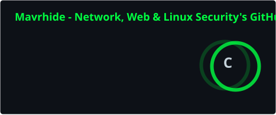
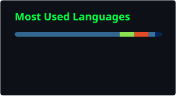

<div align="center">


<br>

[](https://hits.sh/github.com/Mavrhide/)
[](https://t.me/mavrhide)
[](https://profile.hackthebox.com/profile/019df95b-5a96-71ec-aa89-5a83d3e2b07c)
[](https://tryhackme.com/p/mavrhide)
[](https://ctftime.org/user/240350)

</div>

---

## `$ whoami`

Студент 3 курса Дагестанского государственного университета. Сетевая и веб-безопасность, администрирование Linux, детект и анализ атак (SIEM / NTA). Тренируюсь на разных платформах

```yaml
role:      "IT Security Enthusiast / Pentest & Blue Team Learner"
focus:     ["Network Security", "Web Security", "Linux Administration", "Detection Engineering"]
building:  "NEXUS // Range — KVM-based cyber range orchestration"
on_hold:   "LiteTrainingGround (LTG)"
```

<div align="center">


</div>

---

## 🧊 Проекты

<table>
<tr>
<td width="50%" valign="top">

### [NEXUS // Range](https://github.com/NEXUS-RANGE)
**Статус:** `ACTIVE`

Платформа оркестрации киберучений на базе KVM/libvirt: изолированные лаборатории через qcow2 Copy-on-Write, отдельная виртуальная сеть под каждый стенд и доступ к консолям через noVNC без открытия портов наружу.

`Go` · `KVM / libvirt` · `Next.js` · `PostgreSQL` · `noVNC`

[🌐 nexussec.ru](https://nexussec.ru) · [✈️ Telegram](https://t.me/nexus_range) · [💻 GitHub](https://github.com/NEXUS-RANGE)

</td>
<td width="50%" valign="top">

### [LiteTrainingGround (LTG)](https://github.com/Mavrhide/LiteTrainingGround--LTG-)
**Статус:** `ON HOLD ❄️`

Сегментированная сеть банка (DMZ / Corporate / Legacy / SOC) для отработки полного цикла атаки и детекта. Проект заморожен: пока всё внимание на NEXUS. К LTG вернусь позже. Идеи и наработки остаются в репозитории.

`Network` · `SIEM` · `Pentest` · `Blue Team`

</td>
</tr>
</table>

---

<details>
<summary><b>🎓 Сертификаты и участие</b></summary>
<br>

| Документ | Организатор | Дата |
|---|---|---|
| [Анализ событий безопасности с помощью SIEM](https://github.com/Mavrhide/Certificates/blob/main/PT-EdTechLab-SIEM.pdf) | PT EdTechLab (Positive Technologies) | 06.2026 |
| [Анализ сетевых атак с помощью NTA](https://github.com/Mavrhide/Certificates/blob/main/PT-EdTechLab-NTA.pdf) | PT EdTechLab (Positive Technologies) | 05.2026 |
| [Сертификат участника DAG CTF Open (Online)](https://github.com/Mavrhide/Certificates/blob/main/DagCTF.pdf) · команда Cyber Bobrs | DAG CTF | 2026 |

</details>

<details>
<summary><b>🏆 Практика</b></summary>
<br>

- [HackTheBox](https://profile.hackthebox.com/profile/019df95b-5a96-71ec-aa89-5a83d3e2b07c)
- [TryHackMe](https://tryhackme.com/p/mavrhide)
- [CTFtime](https://ctftime.org/user/240350)

</details>

---

## 📊 Stats

<div align="center">




<br>


<sub>Stats и Top Languages генерируются через GitHub Actions в этом репозитории и не зависят от внешних сервисов.</sub>

</div>

---

<details>
<summary><b>🇬🇧 About me (English)</b></summary>
<br>

3rd-year Cybersecurity student at Dagestan State University, focused on network security, web application security and Linux administration, with a growing interest in detection (SIEM / NTA). I train on HackTheBox and TryHackMe and play CTFs with the **Cyber Bobrs** team.

**Now building:** [NEXUS // Range](https://github.com/NEXUS-RANGE) ([nexussec.ru](https://nexussec.ru)), a KVM/libvirt orchestration engine for cyber ranges: isolated labs via qcow2 Copy-on-Write, per-lab virtual networks and noVNC console access with no exposed ports.

**On hold:** [LiteTrainingGround](https://github.com/Mavrhide/LiteTrainingGround--LTG-), a segmented bank-like cyber range (DMZ / Corporate / Legacy / SOC). Frozen for now while NEXUS takes priority; I plan to come back to it.

| Certificate | Provider | Date |
|---|---|---|
| [Security Event Analysis with SIEM](https://github.com/Mavrhide/Certificates/blob/main/PT-EdTechLab-SIEM.pdf) | PT EdTechLab (Positive Technologies) | Jun 2026 |
| [Network Attack Analysis with NTA](https://github.com/Mavrhide/Certificates/blob/main/PT-EdTechLab-NTA.pdf) | PT EdTechLab (Positive Technologies) | May 2026 |
| [DAG CTF Open (Online): participant certificate](https://github.com/Mavrhide/Certificates/blob/main/DagCTF.pdf), team Cyber Bobrs | DAG CTF | 2026 |

</details>

<div align="center">

<br>

📫 **Связь / Contact:** [Telegram](https://t.me/mavrhide)


</div>
